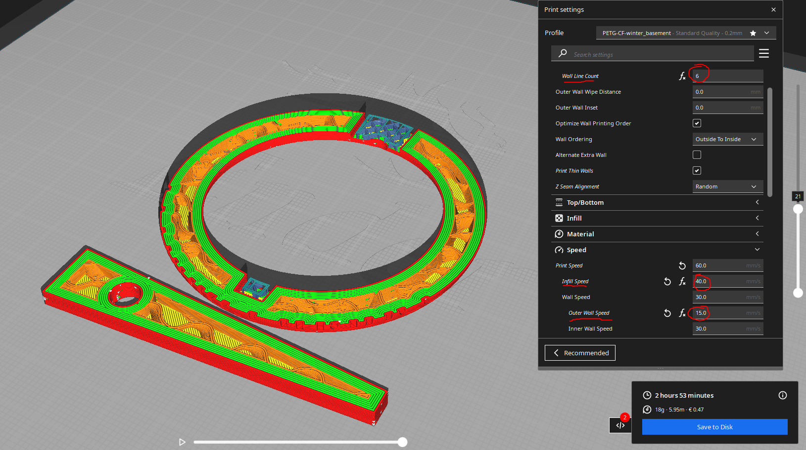

# Carabiner Ring-&-Pin MKI 'Hole'

An original design by Fabrico.Labs created as a novel, functional merchandise for marketing of Pecunia.Finance DAO.

## Description

A printable carabiner in the style of a [annular brooch](https://en.wikipedia.org/wiki/Brooch) which leverages the strengths of [FDM](https://de.wikipedia.org/wiki/Fused_Deposition_Modeling) to create a strong ring which can be used for light-weight, cosmetic purposes such as:

- keyring
- decoration
- backpack strap buckle
- etc.

```
DO NOT USE THIS CARABINER FOR CLIMBING OR LIFTING HEAVY WEIGHT. MAXIMUM LOAD HAS NOT BEEN DETERMINED OR EVEN TESTED. FOR DECORATIVE PURPOSES ONLY.
```

## Materials

### Filament

- PETG-Carbon-Fiber (**Recommended**)
- PETG

### Additional Materials

#### Keyring

The hole design (MKI & MKIII) is based upon common, commercially available, wire keychains.

- These usually have a 4M / 4mm OD screw
- Example _keyring_ on [Amazon](https://www.amazon.com/Pawfly-Keychain-Stainless-Outdoor-Hiking/dp/B07FY6M1JZ/ref=sr_1_5?crid=XAH9F4YLXHCF&keywords=wire%2Bkeychain&qid=1703327050&sprefix=wire%2Bkeychain%2Caps%2C205&sr=8-5&th=1)


#### Metal Insert

Using a metal insert to [re-enforce the hole](#mki-hole) is advisable, as cordage/wire will rub away the plastic over time

- Example _metal insert_ on [Amazon](https://www.amazon.com/Fashewelry-Stainless-Corrugated-Bracelet-Necklace/dp/B085ZBBSTS/ref=sr_1_15?crid=2W7JNNAJ9RSQS&keywords=steel%2Bbead%2B5mm&qid=1703327471&sprefix=steel%2Bbead%2B5mm%2Caps%2C160&sr=8-15&th=1)


## General Print Settings

The following are generally recommended settings and parameters for printing this part.

### Temperatures

- PETG-CF
  - Print Temp.: 250-255 C
  - Bed Temp.: 72 C
- PETG
  - Print Temp.: 240-247 C
  - Bed Temp.: 70 C

### Adhesion

No adhesion support is necessary **as long as the bed is leveled**.

### Support

- Type: Normal
- Placement: Everywhere
- Density: 10%
- X/Y Distance: 0.4-1mm

## Additional Details

A 4mm diameter hole is centered in the pin, just at the inside edge of the ring. Threading a chain, wire, or other cordage through the hole will prevent the pin from dislodging far enough to open the center pin-lock.

To extend the life of this print, a metal tube insert (see additional materials below) can be sunk into the hole in the pin using a soldering iron set to 200-250 degrees Celecius, based on the quality/accuracy of the soldering iron.

### Additional Materials

The following materials are **optional**:

- 4mm ID (max. 6mm OD/Width) x 5mm Height/Length metal (steel) bead, tube, or insert.
- Soldering Iron (min. 260 degrees Celcius)

### Unique Print Settings

- No supports needed, but recommended.



## Redundant Disclaimer

AS DESCRIBED IN THE LICENSES, THE SOFTWARE IS PROVIDED “AS IS”, AT YOUR OWN RISK, AND WITHOUT WARRANTIES OF ANY KIND.

No developer or entity involved in creating this software will be liable for any claims or damages whatsoever associated with your use, inability to use, or your interaction with other users of the code, including any direct, indirect, incidental, special, exemplary, punitive or consequential damages, or loss of profits, cryptocurrencies, tokens, or anything else of value.

And again:

```
DO NOT USE THIS CARABINER FOR CLIMBING OR LIFTING HEAVY WEIGHT. MAXIMUM LOAD HAS NOT BEEN DETERMINED OR EVEN TESTED. FOR DECORATIVE PURPOSES ONLY.
```
