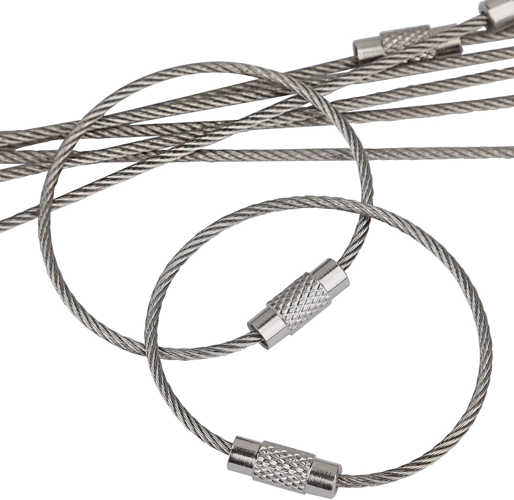
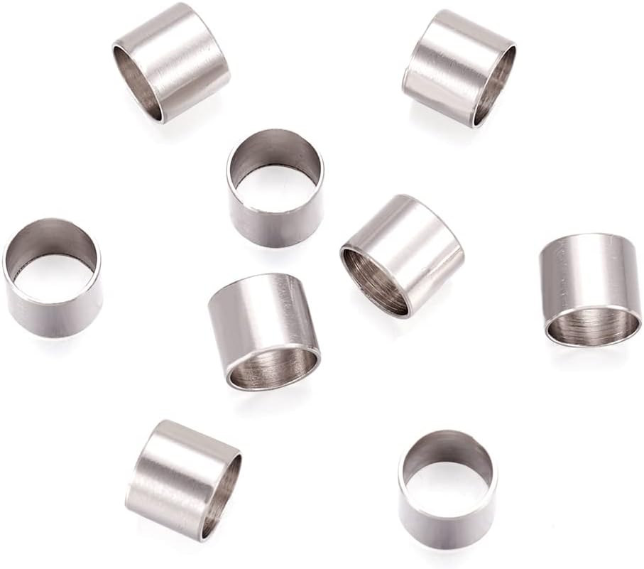

# Carabiner Ring-&-Pin

An original design by Fabrico.Labs created as a novel, functional merchandise for marketing of Pecunia.Finance DAO.

## Description

A printable carabiner in the style of a [annular brooch](https://en.wikipedia.org/wiki/Brooch) which leverages the strengths of [FDM](https://de.wikipedia.org/wiki/Fused_Deposition_Modeling) to create a strong ring which can be used for light-weight, cosmetic purposes such as:
- keyring
- decoration
- backpack strap buckle
- etc.

```
DO NOT USE THIS CARABINER FOR CLIMBING OR LIFTING HEAVY WEIGHT. MAXIMUM LOAD HAS NOT BEEN DETERMINED OR EVEN TESTED. FOR DECORATIVE PURPOSES ONLY.
```

## Materials

### Filament
- PETG-Carbon-Fiber (**Recommended**)
- PETG (*optional*)

### Additional Materials

#### Keyring
The hole design (MKI & MKIII) is based upon common, commercially available, wire keychains.
- These usually have a 4M / 4mm OD screw
- Example *keyring* on [Amazon](https://www.amazon.com/Pawfly-Keychain-Stainless-Outdoor-Hiking/dp/B07FY6M1JZ/ref=sr_1_5?crid=XAH9F4YLXHCF&keywords=wire%2Bkeychain&qid=1703327050&sprefix=wire%2Bkeychain%2Caps%2C205&sr=8-5&th=1)



#### Metal Insert
Using a metal insert to [re-enforce the hole](#mki-hole) is advisable, as cordage/wire will rub away the plastic over time
- Example *metal insert* on [Amazon](https://www.amazon.com/Fashewelry-Stainless-Corrugated-Bracelet-Necklace/dp/B085ZBBSTS/ref=sr_1_15?crid=2W7JNNAJ9RSQS&keywords=steel%2Bbead%2B5mm&qid=1703327471&sprefix=steel%2Bbead%2B5mm%2Caps%2C160&sr=8-15&th=1)



## General Print Settings

The following are generally recommended settings and parameters for printing this part.

### Temperatures
- PETG-CF
    - Print Temp.: 250-255 C
    - Bed Temp.: 72 C
- PETG
    - Print Temp.: 240-247 C
    - Bed Temp.: 70 C

### Adhesion
No adhesion support is necessary **as long as the bed is leveled**.

### Support
- Type: Normal
- Placement: Everywhere
- Density: 10%
- X/Y Distance: 0.4-1mm

## Versions
- [MKI Hole](#mki-hole)
- [MKII Clip](#mkii-clip)

### MKI 'Hole'

A 4mm diameter hole is centered in the pin, just at the inside edge of the ring. Threading a chain, wire, or other cordage through the hole will prevent the pin from dislodging far enough to open the center pin-lock.

To extend the life of this print, a metal tube insert (see additional materials below) can be sunk into the hole in the pin using a soldering iron set to 200-250 degrees Celecius, based on the quality/accuracy of the soldering iron.

#### Additional Materials
The following materials are **optional**:
- 4mm ID (max. 6mm OD/Width) x 5mm Height/Length metal (steel) bead, tube, or insert.
- Soldering Iron (min. 260 degrees Celcius)

#### Unique Print Settings
- No supports needed, but recommended.

### MKII 'Clip'

The pin has arms which form a [compliant mechanism](https://www.compliantmechanisms.byu.edu/), allowing the pin to lock into place with an audible snapping sound and then be released again by manipulating the arms. There are no moving parts, only bending.


#### Pin Removal Instructions

Both hands must be used to remove the pin. Perform the following steps to remove the pin:
1. Orient the ring with the part of the pin protruding from the ring pointing toward you and downwards.
2. Place both hands on the ring, like a steering wheel.
3. Pry the ends of the arms out and downwards, by using your fingernails.

**Note:** If no fingernails available, use a small thin blade, key-tip, flat-head screwdriver, etc. to pry the arms into release position while pushing/pulling downwards on the pin.

#### Unique Print Settings
- Support Z Distance: 0.1mm or simply ensure that supports are created for the pin's arms, which are ~0.4mm (or two layers) higher than the bottom of the pin.
- Supports are highly recommended within the ring, to ensure the space for the pin's arms will not require significant post-processing.

**Note:** Spacing between models are 0.3mm apart to account for thermal expansion and tolerance of printing accuracy.

## Redundant Disclaimer

AS DESCRIBED IN THE LICENSES, THE SOFTWARE IS PROVIDED “AS IS”, AT YOUR OWN RISK, AND WITHOUT WARRANTIES OF ANY KIND.

No developer or entity involved in creating this software will be liable for any claims or damages whatsoever associated with your use, inability to use, or your interaction with other users of the code, including any direct, indirect, incidental, special, exemplary, punitive or consequential damages, or loss of profits, cryptocurrencies, tokens, or anything else of value.

And again:
```
DO NOT USE THIS CARABINER FOR CLIMBING OR LIFTING HEAVY WEIGHT. MAXIMUM LOAD HAS NOT BEEN DETERMINED OR EVEN TESTED. FOR DECORATIVE PURPOSES ONLY.
```