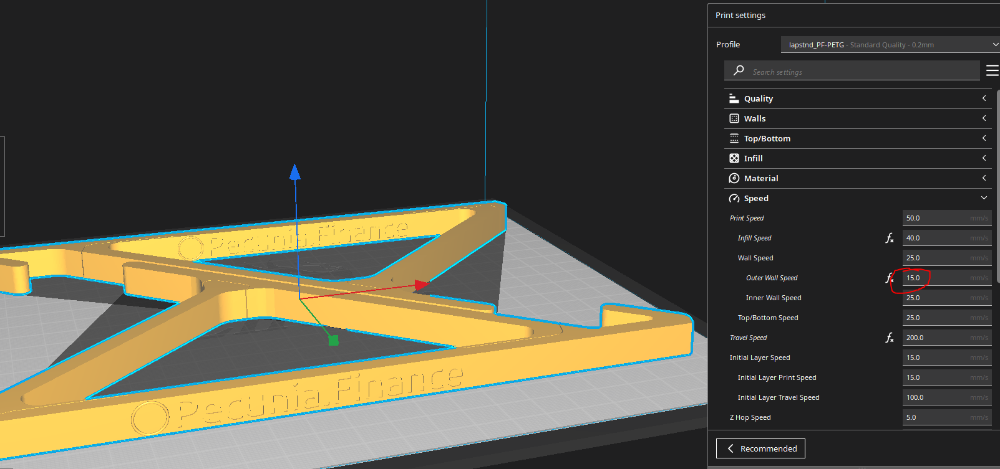

# Laptop Stand

An original design by Fabrico.Labs created as a novel, functional merchandise for marketing of Pecunia.Finance DAO.

## Description

A printable set (two parts) which leverages the strengths of [FDM](https://de.wikipedia.org/wiki/Fused_Deposition_Modeling) to create a strong laptop stand which can be compacted into a smaller form for storage using integrated [compliant mechanisms](https://www.compliantmechanisms.byu.edu/).

## Materials

### Filament

- PETG (**Recommended**)
- PETG-Carbon-Fiber (_untested_)

### Additional Materials

N/A

## General Print Settings

The following are generally recommended settings and parameters for printing this part.

### Temperatures

- PETG
  - Print Temp.: 240 C
  - Bed Temp.: 70 C

### Adhesion

No adhesion support is necessary **as long as the bed is leveled**.

### Support

N/A

## Versions

About 16 iterations of the design were created, each with different measurements and concepts. The published version is the 17th iteration of the design.

### V17

This model features a simple triangular structure which leverages the bottom edge of a laptop against the bracing arm situated 45 Degrees, perpendicular to the main arm which lies flush against the back of the laptop.

The bracing arm is separate from the main arm but held in place by the curvature of the upper end of the bracing arm sitting in a divet of the main arm. Where the main arm and brace arm meet the base, there are [compliant mechanisms](https://www.compliantmechanisms.byu.edu/) which allow the arms to be bent into a compact form. The potential energy is stored in the plastic and returns the model to its functional form when released.

```
Two models must be printed to complete the set.
```



#### Additional Materials

N/A

#### Unique Print Settings

- No supports needed
- Outer Wall Speed: 15 mm/s for best definition of logo
- This design is Print-In-Place

## Redundant Disclaimer

AS DESCRIBED IN THE LICENSES, THE SOFTWARE IS PROVIDED “AS IS”, AT YOUR OWN RISK, AND WITHOUT WARRANTIES OF ANY KIND.

No developer or entity involved in creating this software will be liable for any claims or damages whatsoever associated with your use, inability to use, or your interaction with other users of the code, including any direct, indirect, incidental, special, exemplary, punitive or consequential damages, or loss of profits, cryptocurrencies, tokens, or anything else of value.
